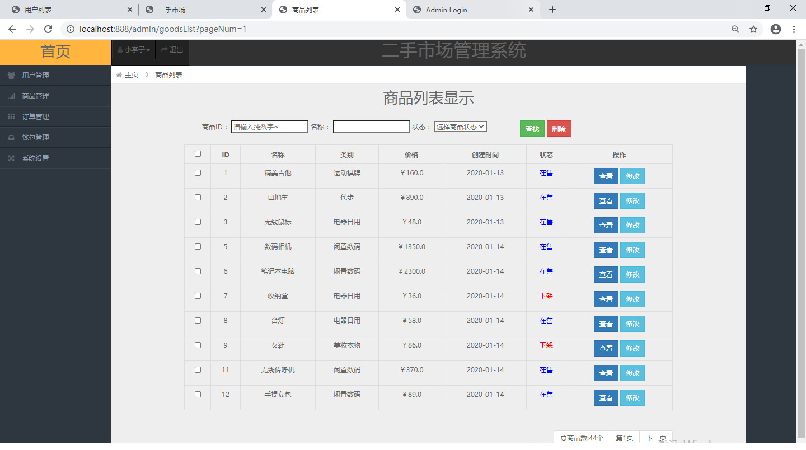
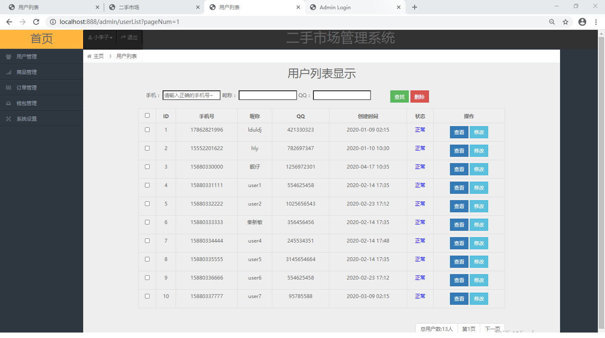
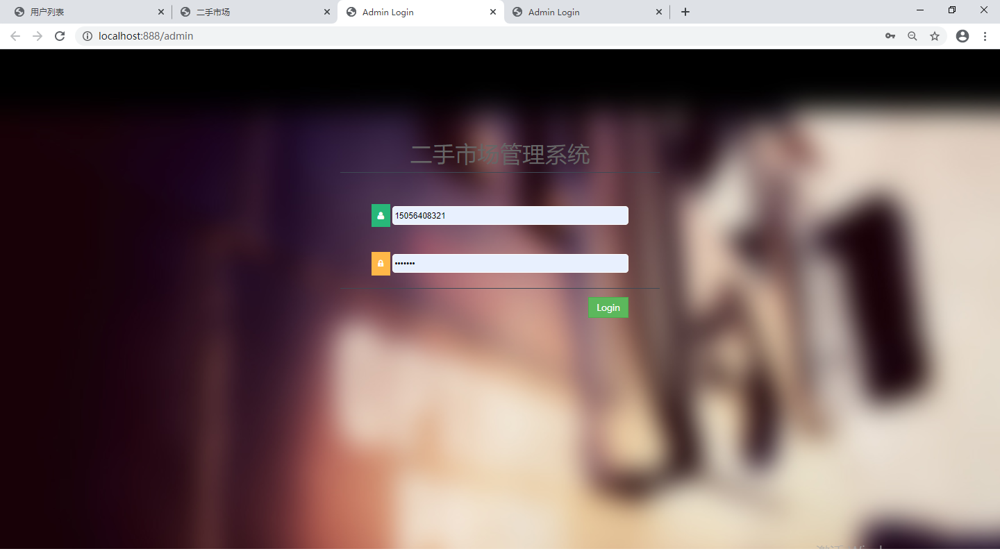
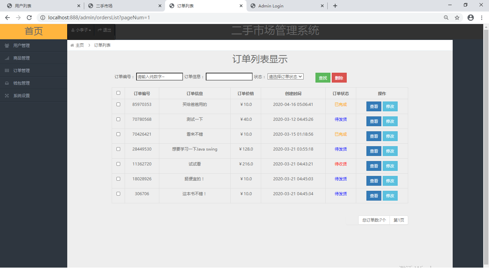
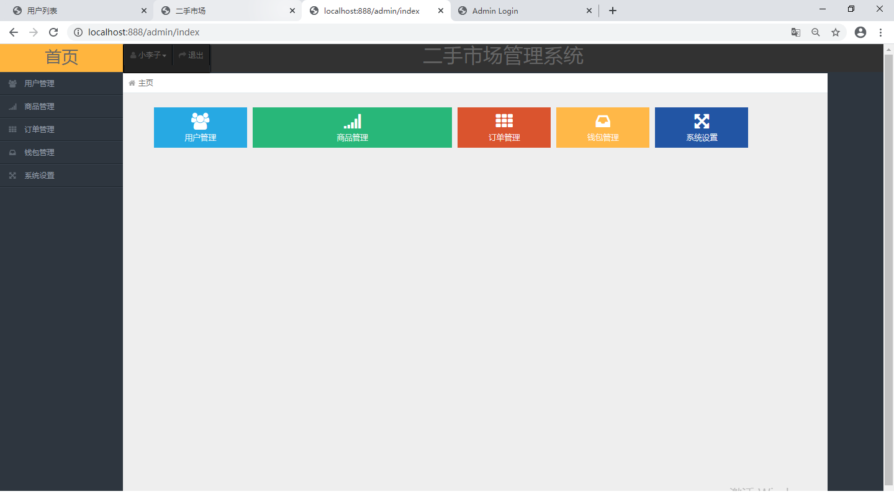
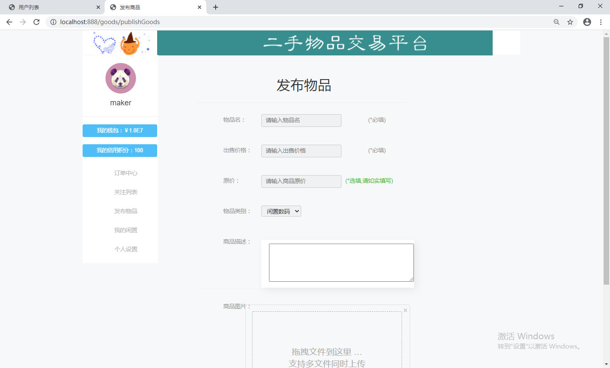
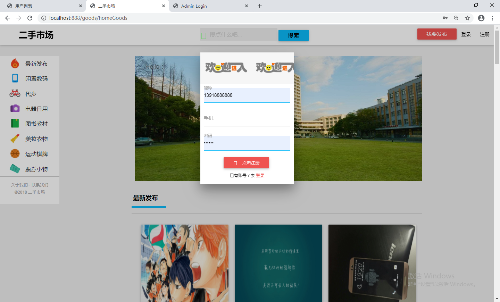
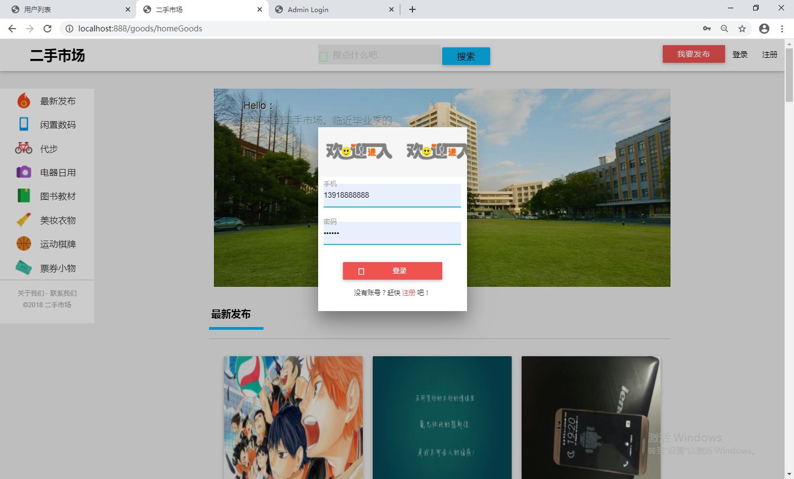
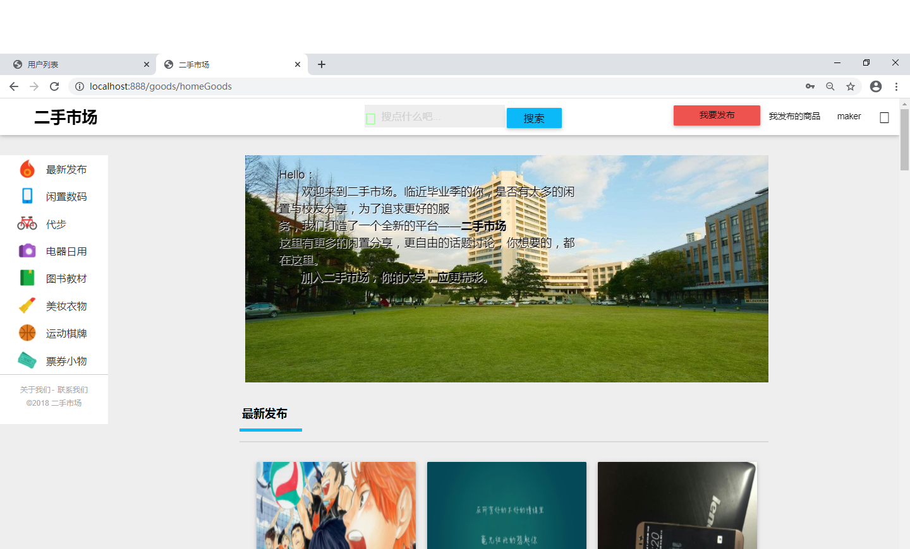

这是一个基于java的ssm框架的二手交易平台

项目代码已收录公众号【java项目源码】，需要请自行关注一下公众号并下载源码

本系统分为三种权限：

1.游客：游客访问系统可以浏览相关商品

2.用户：游客登录后成为用户，不仅可以浏览商品，还可以对商品加入购物车，购买商品，以及在个人中心发布商品，对自己的账号钱包进行充值

3.管理员：对物流信息进行管理，对用户充值情况进行管理，对订单信息进行管理等等

SSM框架：Spring SpringMVC Mybatis，前端使用jsp技术（可修改为任意商城系统）

CSDN博客地址：[ssm框架的二手交易平台](https://blog.csdn.net/mataodehtml/article/details/111885800)

管理员：

用户：

